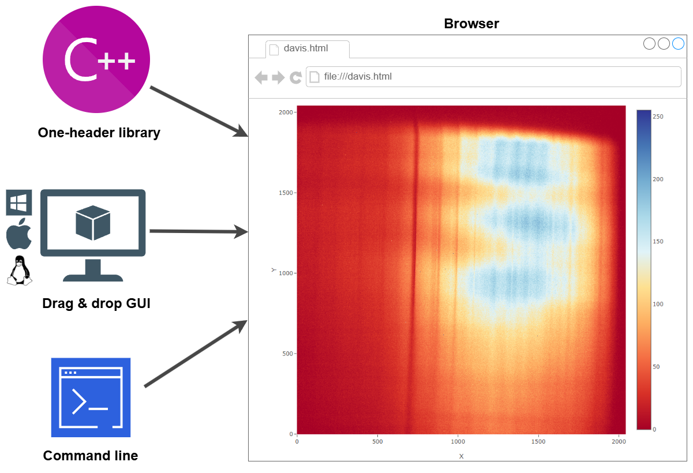

 

# [------------> FULL DOCUMENTATION PAGE <------------](https://devtoolsorganization.github.io/matrix-data-visualization-DAVIS/#/)

 

# 💡 About
DAVIS (Data Visualisation tool) is utility for data visualization. The visualization is based on [Plotly javascript](https://plotly.com/).
DAVIS generates html page with injected data from code and after that launch browser to show it.
DAVIS is available like C++ one-header library for quick matrix debugging/visualization, GUI- and CMD- application for text files visualization.

One of the main tasks we solve is to make it easier to debug your application. With DAVIS you can easy visualize your one- and two-dimensional data variables.
The second one task is quick and easy visualization of files with numerical data with GUI application.

# ⚒️ Setup
[Visit setup page](https://devtoolsorganization.github.io/matrix-data-visualization-DAVIS/#/downloads)

 
# 🐝 Authors

<table>
  <tbody>
   <tr style="border: 1px">
    <td align="center" >
      
       
      Anton
    </td>
    <td align="center">
      
       
      Valery
    </td>

   </tr>
  <tbody>
</table>

# 📞 Contacts
For any questions please contact 
devtools.public@gmail.com

# 📝 License
License is [MIT](https://opensource.org/license/mit)

Copyright 2024 Anton Martinov & Valery Stanchyk 

Permission is hereby granted, free of charge, to any person obtaining a copy of this software and associated documentation files (the “Software”), to deal in the Software without restriction, including without limitation the rights to use, copy, modify, merge, publish, distribute, sublicense, and/or sell copies of the Software, and to permit persons to whom the Software is furnished to do so, subject to the following conditions:

The above copyright notice and this permission notice shall be included in all copies or substantial portions of the Software.

THE SOFTWARE IS PROVIDED “AS IS”, WITHOUT WARRANTY OF ANY KIND, EXPRESS OR IMPLIED, INCLUDING BUT NOT LIMITED TO THE WARRANTIES OF MERCHANTABILITY, FITNESS FOR A PARTICULAR PURPOSE AND NONINFRINGEMENT. IN NO EVENT SHALL THE AUTHORS OR COPYRIGHT HOLDERS BE LIABLE FOR ANY CLAIM, DAMAGES OR OTHER LIABILITY, WHETHER IN AN ACTION OF CONTRACT, TORT OR OTHERWISE, ARISING FROM, OUT OF OR IN CONNECTION WITH THE SOFTWARE OR THE USE OR OTHER DEALINGS IN THE SOFTWARE.
