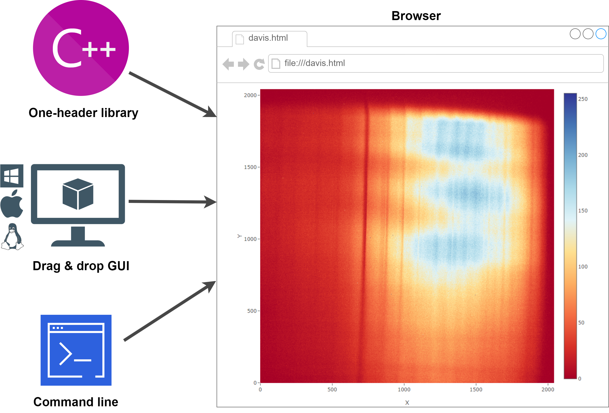

# Introduction

## 💡 About
DAVIS (Data Visualisation tool) is utility for data visualization. The visualization is based on [Plotly javascript](https://plotly.com/).
DAVIS generate html page with injected data from code and after that launch browser to show it.
DAVIS is available like C++ one-header library for quick matrix debugging/visualization, GUI- and CMD- application for text files visualization.

## 📜 Background 
In our work, we often had to visualize data arrays while programming in C++. We tried a huge number of visualization tools, but none of them met
our following requirements:
- no need to use heavy libraries, which also require compilation. Preferably a one-header library;
- only pure C++ functionality, no frameworks and dependencies;
- intuitively simple use without a long study of the documentation. Data visualization from code should be called with just one line of code - one function;
- cross-platform;
- working offline without using online visualization platforms.

All these requirements were embodied in DAVIS.

Also, applications with a command line interface and a graphical interface were created on C++ DAVIS library basis, which allow you to display
numeric data in text files, automatically selecting the desired type of visualization and conducting semantic analysis of the file contents.

<table>
<tbody>
<tr style="height: 68px; border: 1px">
<td style="width: 15%; height: 68px; text-align: left;  vertical-align: top;">

       

<a href="/matrix-data-visualization-DAVIS/#/c++_intro.md">Documentation С++</a>

     

<a href="/matrix-data-visualization-DAVIS/#/gui_intro.md">Documentation GUI</a>

    

<a href="/matrix-data-visualization-DAVIS/#/cmd_intro.md">Documentation CMD</a>

 

</td>
<td style="width: 85%; height: 177px;">

&nbsp;

<h1 style="color: #5e9ca0;"></h1>
</td>
</tr>
</tbody>
</table>
                                        

## ⭐ Used By
This project is used by the following companies:
- A. N. Sevchenko  Institute  of  Applied  Physical Problems of Belarusian State University
 

## 🐝 Authors

<table>
  <tbody>
   <tr style="border: 1px">
    <td align="center" >
      
       
      Anton
    </td>
    <td align="center">
      
       
      Valery
    </td>

   </tr>
  <tbody>
</table>

## 📞 Contacts
For any questions please contact 
devtools.public@gmail.com
 
 
 

[Next page →](/c++_intro.md)