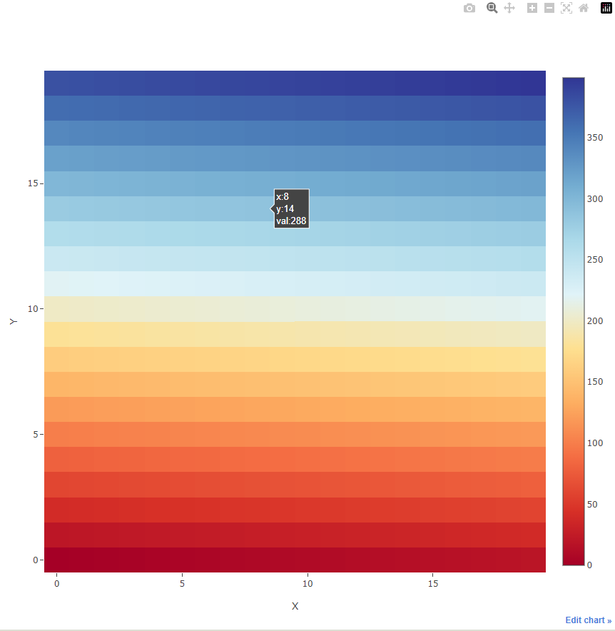
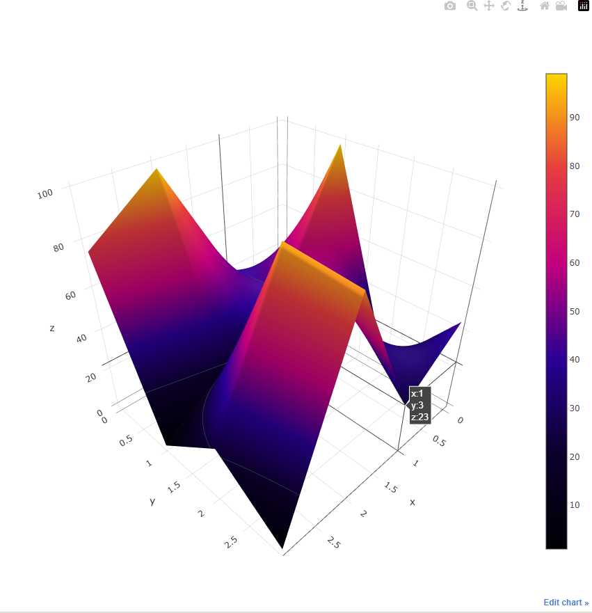
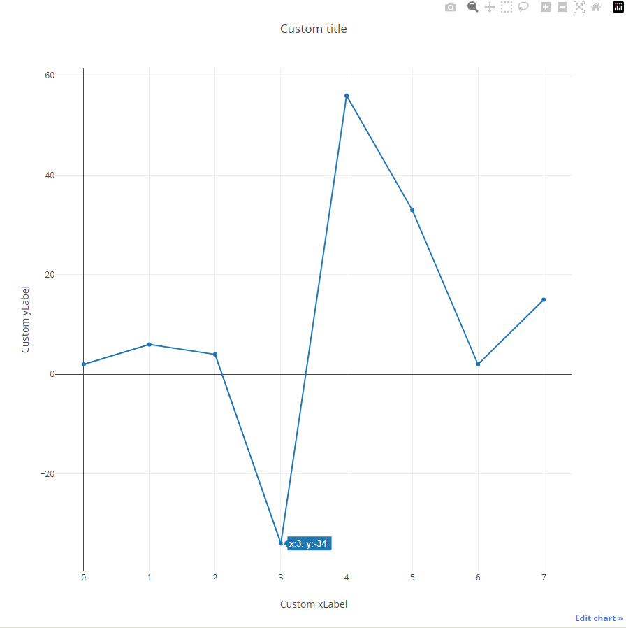
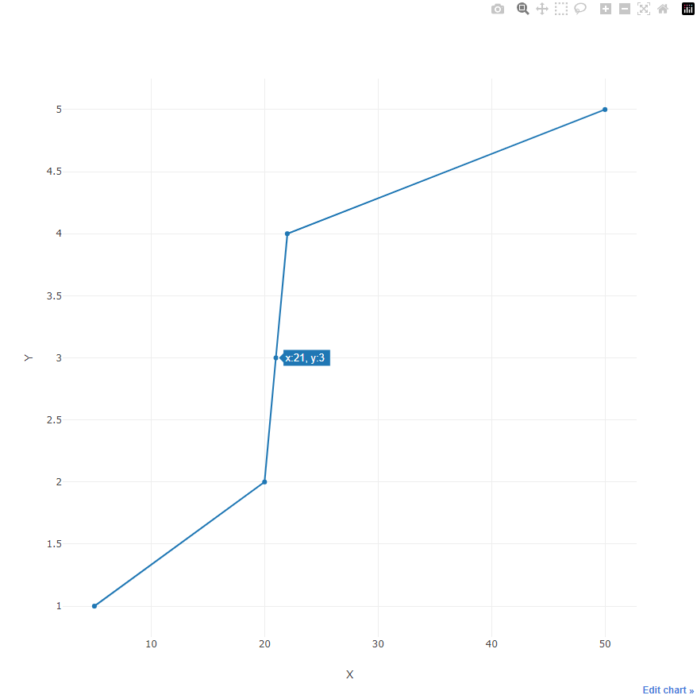

# 🔍 Examples

<!-- tabs:start -->

# **Heatmap**

```cpp
#include "davis.h"

// vals - user 2d array for visualizing
int rows = 20;
int cols = 20;
int** vals = new int* [rows];
  for (int i = 0; i < rows; ++i) {
    vals[i] = new int[cols];
    for (int j = 0; j < cols; ++j) {
      vals[i][j] = i * cols + j;
    }
}
dv::show(vals, rows, cols);  // pass varible and dimensions of 2d array  
```


# **Surface**

```cpp
#include "davis.h"

//it possible and std::list<std::vector<double>> values = ...
//                std::vector<std::list<double>> values = ...
std::vector<std::vector<double>> values = {{30.3, 40, 98, 76} 
                                         , {99, 45, 20, 1}
                                         , {5, 56, 93, 25}
                                         , {45, 23, 90, 2}};
 auto config = dv::Config();
 config.typeVisual = dv::VISUALTYPE_SURFACE;              // select surface visual mode           
 config.surf.colorSc = dv::COLORSCALE_THERMAL;                   // change colorscale
 bool result = dv::show(values, "testSurfacePage", config);      // pass 2d data, html page name, configuration structure
```



# **Chart**

```cpp
#include "davis.h"

int vals[] = {2, 6, 4, -34, 56, 33, 2, 15 };
auto config = dv::Config();
config.heatmap.title = "Custom title";            // change default settings to custom for heatmap
config.heatmap.xLabel = "Custom xLabel";          // change default settings to custom for heatmap
config.heatmap.yLabel = "Custom yLabel";          // change default settings to custom for heatmap
bool result = dv::show(vals, sizeof(vals) / sizeof(vals[0]), "htmlPageName", config);
```


# **Chart with separate XY**

```cpp
#include "davis.h"
using std::vector;

vector<vector<double>> values;
vector<double> vecX = {5, 20, 21, 22, 50};
vector<double> vecY = {1, 2, 3, 4, 5};
bool result = dv::show(vecX, vecY, "showChartXY_2containers");
```


# **Saving as text**

```cpp
#include "davis.h"
using std::vector;

// -------------------- 2-dimensional data. Container of containers --------------------
int rows = 10;
int cols = 5;
vector<vector<int>> arr2;
for (int i = 0; i < rows; ++i) {
  vector<int> vec(cols);
  for (int j = 0; j < cols; ++j) {
    vec[j] = i * cols + j;
  }
  arr2.emplace_back(vec);
}
dv::save(arr2, "test_saving_save_to_disk_container2D.csv");


// ----------- 1-dimensional array that simulates a 2-dimensional -------------------- 
int* vals = new int[rows * cols];
for (int i = 0; i < rows; ++i) {
  for (int j = 0; j < cols; ++j) {
    vals[i * cols + j] = i * cols + j;
  }
}
dv::configSaveToDisk conf;
conf.separatorOfCols = ";";
conf.separatorOfRows = "\n";
dv::save(vals, rows, cols, "test_saving_save_to_disk_pseudo_2d.csv", conf);

// -------------------- Two 1-dimensional containers for XY chart -------------------- 
vector<double> vecX;
for (int i = 0; i < 10; ++i) {
  vecX.emplace_back(i * 2);
}
vector<double> vecY;
for (int i = 0; i < 10; ++i) {
  vecY.emplace_back(i * 3);
}
bool result = dv::save(vecX, vecY, "test_saving_save_to_disk_XYdata.csv");
```

<!-- tabs:end -->

[Next page →](/c++_installation.md)

