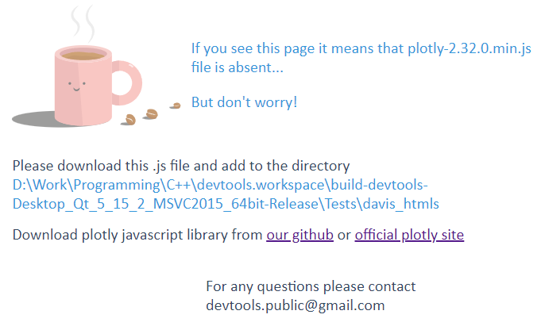

# ⚒️ Installation

1. Download **davis.cpp**, **davis.h** and **plotly-2.32.0.min.js** from our last [release](https://github.com/valvals/devtools/releases)
2. Put **davis.cpp**, **davis.h** in one folder in your project
3. Put **plotly-2.32.0.min.js** to  folder *your build_folder/davis_htmls*
4. Include **davis.h** to your project
5. Now you can use Davis functionality 

> [!Note]
> If you are lazy to find folder at **step №3** you can skip this step. While running Davis you will be shown error page where you will see path you need
> 

[Next page →](/gui_intro.md)