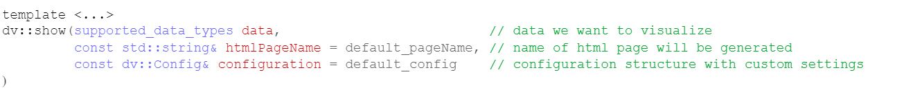
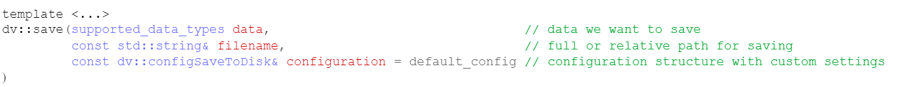

# 💻 Usages
All you need is just include "davis.h" and use it's functions from `dv::` namespace

## show(...) function
There is one template overload function to visualize different types of data:




<a name="arguments"></a>
First argument(s) of `dv::show(...)` is data we want to visualize. They are could be either pointer to template array with type `T` with array sizes:

| Arguments  | Description  |
| ------------ | ------------ |
|  `T**` data, `uint64_t` arrRows, `uint64_t` arrCols      |   2d array with arrRows × arrCols size. Data placed inside array of arrays |
|  `const T*` data, `uint64_t` arrRows, `uint64_t` arrCols |   2d array with arrRows × arrCols size.  Data placed inside pseudo 2d array (element access [i*arrCols + j])  |
|  `const T*` data, `uint64_t` count                       |   1d array. Data placed inside array  |

or template container with  type `C`:

| Arguments  | Description  |
| ------------ | ------------ |
|  `C const&` container_of_containers          |   2d array. Data placed inside container of containers. Containers can be `std::vector`, `std::list`, `std::array`, etc. Content of containers must be convertable to `double`                        |
|  `C const&` container                        |   1d array. Data placed inside container. Сontainer requirements are the same                            |

</br>

```cpp
 std::vector<int> vec = {-5, -3, -1, 0, 2, 4, 8, 15, 16};
 dv::show(vec, "example1");
```
```cpp
 double vals[] = {2, 6, 4, -34, 56, 33, 2, 15};
 dv::show(vals, sizeof(vals) / sizeof(vals[0]), "example2");
```
  
### Configuration
Data vizuailisation can be tunned with using custom configuration object `dv::Config`.

1. Create `dv::Config` object;
```cpp
auto config = dv::Config();
```

2. Change it's type (or leave it default, so it will be `VISUALTYPE_AUTO`) 
```cpp
config.typeVisual = dv::VISUALTYPE_SURFACE;
```

3. Change fields of neaded visualisation type

| Name of structure | Description  |
| ------------ | ------------ |
|chart       |for chart settings|
|heatmap     |for heatmap settings |
|surf        |for surface settings|

```cpp
config.surf.colorSc = dv::COLORSCALE_THERMAL;
config.surf.title = "Custom title";            
config.surf.xLabel = "Custom xLabel";          
config.surf.yLabel = "Custom yLabel";          
config.surf.zLabel = "Custom zLabel";  
```

4. Pass it to `dv::show(...)`;
```cpp
dv::show(yourData, "yourName", config);
```

> [!attention]
> While filling config fields be sure you are tunning correct visualisation type, i.e. if you want to show
> data as **surface**  fill  **config.surface** fields but not **config.heatmap**


## save(...) function
There is one template overload function for saving different types of data as text files:


Supported data types are identical to described for [show(...) function](#show-function)

### Configuration
Data saving can be tunned with using custom configuration object `dv::configSaveToDisk`.

| Name of field | Description  | Default value  |
| ------------ | ------------ | ------------ |
|separatorOfRows       |std::string object that will separate rows in txt file| \n|
|separatorOfCols     |std::string object that will separate rows in txt file | ;|
|isTranspose        |Is transpose of  matrix data neaded <br> (example: you can save vector as a 1 column or as a 1 row in txt file)| false|

> [!Note]
> Text file is saving with UTF-8 encoding 

[Next page →](/c++_examples.md)