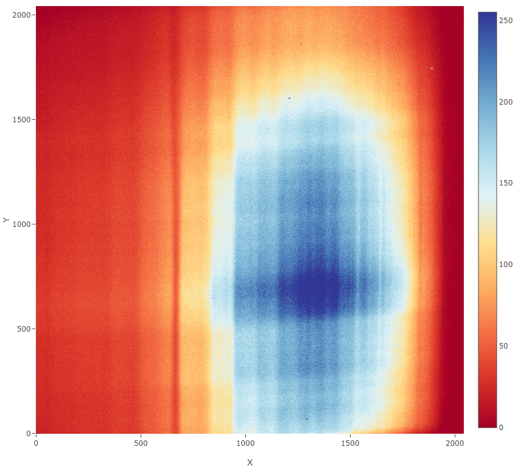
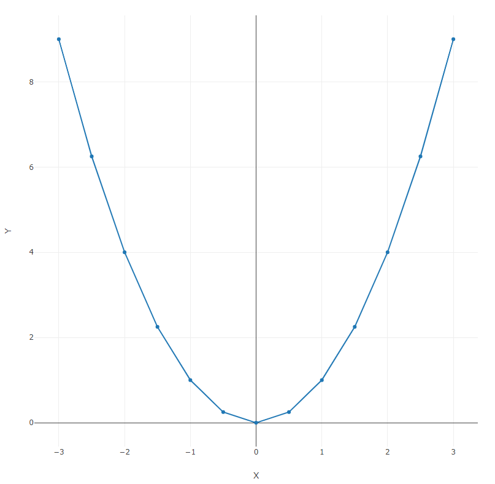
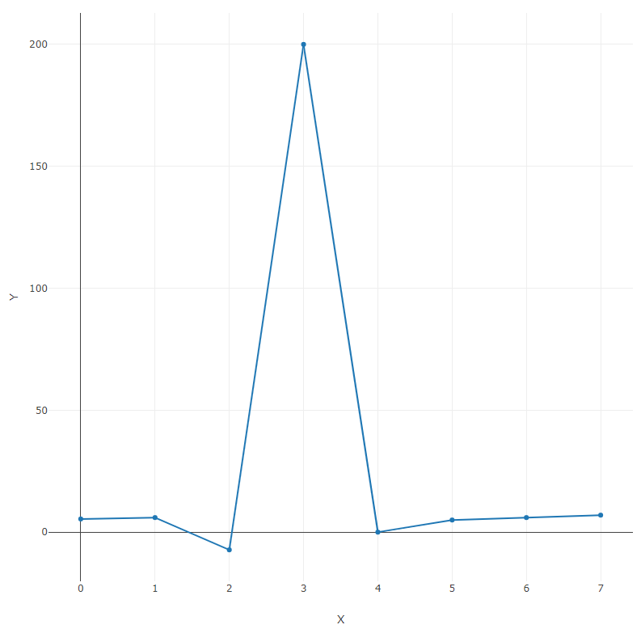

# 🔍 Examples

<!-- tabs:start -->

# **Large 2D matrix**

bigFile.csv - [download example](_media/gui/bigFile.csv ':ignore')

# **XY chart**

xy.csv - [download example](_media/gui/xy.csv ':ignore')

# ** 1 column data**

column.csv - [download example](_media/gui/column.csv ':ignore')

<!-- tabs:end -->

[Next page →](/gui_installation.md)
