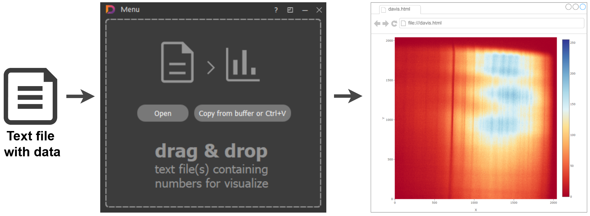

# Application with GUI 

The main goal of GUI applicaton is quick and easy visualization of files with numerical data.

Data files can be in simple txt format with separators or in json format

We are using smart recognising of:
* column & line separators
* where is number data and where is text headers
* what type of data visualization  is more appropriate
* date-time formats for X axis