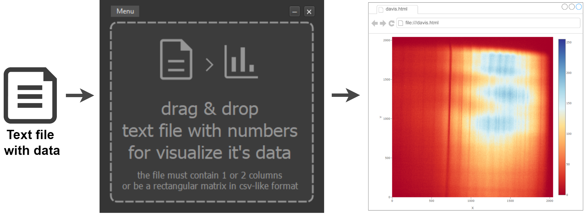

# 💻 Usages

1. Run davis.exe file
2. Drag and drop your text files to application window
3. Wait for vizualization data in browser

We are using smart recognising of:
* column & line separators
* where is number data and where is text headers
* what type of data visualization  is more appropriate

[Next page →](/gui_examples.md)
