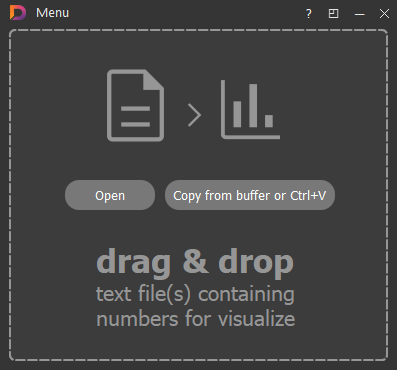

# 💻 Usages

1. Run dv.exe file

2. Open text file by 
    2.1 drag and drop  text files to application window (you can drag many files at once)
    2.2 button "Open"
    2.3 copy text data from clipboard. (For example: Select data cells in Microsoft Excel, Ctrl+C, activate DAVIS GUI and Ctrl+V)
3. Wait for vizualization data in browser

